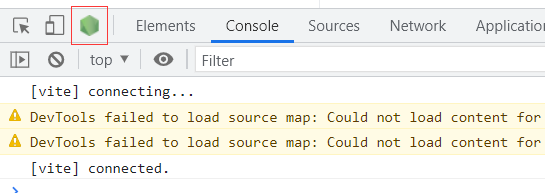

<h1>第一个插件</h1>

## 最简单的插件

```javascript
module.exports = class FirstPlugin {
    
    constructor() {
        console.log('FirstPlugin created!');
    }

    apply(compiler) {
        console.log("FirstPlugin apply!");
    }
    
}
```

`webpack`在运行插件时会进行如下四步
1. `webpack`加载配置,会通过配置种插件的`new FirstPlugin()`,执行构造器函数
2. `webpack`创建`compiler`对象
3. 遍历所有插件,调用插件的`apply`方法
4. 执行剩下编译流程(触发各个`hooks`)

## 注册hooks

```javascript
module.exports = class FirstPlugin {
    constructor() {
        console.log("FirstPlugin创建了");
        
    }

    apply(compiler) {
        console.log("FirstPlugin apply了");
        
        // enviroment是同步钩子
        compiler.hooks.environment.tap("1", () => {
            console.log("enviroment 触发了!");
        })

        // emit是异步串行钩子
        compiler.hooks.emit.tap("1", (compilation) => {
            console.log("emit触发了");
        })

        compiler.hooks.emit.tapAsync("2", (compilation, callback) => {
            setTimeout(() => {
                console.log("emit异步触发了");
                callback();
            },1000)
        })
        
        compiler.hooks.emit.tapPromise("3", (compilation) => {
            return new Promise((resolve,reject) => {
                setTimeout(() => {
                    console.log("emit promise");
                    resolve();
                },1000)
            })
        })

        // make是异步并行钩子
        compiler.hooks.make.tapAsync("1", (compilation, callback) => {
            
            compilation.hooks.seal.tap("1", () => {
                console.log("emit的compilation的seal触发了");
            })

            setTimeout(() => {
                console.log("FirstPlugin make!");
                callback();
            }, 1000)
        })

        compiler.hooks.make.tapPromise("1", (compilation) => {
            return new Promise((resolve,reject) => {
                setTimeout(() => {
                    console.log("make promise");
                    resolve();
                }, 1000)
            })
        })
    }
}
```

### 启动调试

添加`package.json`中`script`
```json
"debug": "node --inspect-brk ./node_modules/webpack-cli/bin/cli.js"
```

执行该命令后,浏览器控制会出现一个`Node`图标,点击即可进入调试



可以在代码中使用`debugger`或者在调试界面中添加断点进行调试