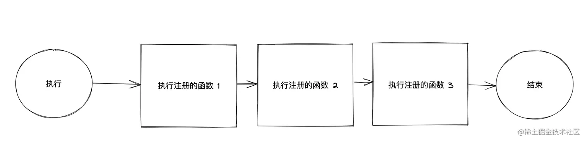
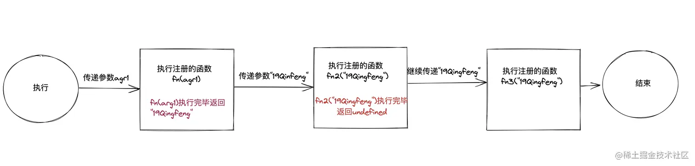
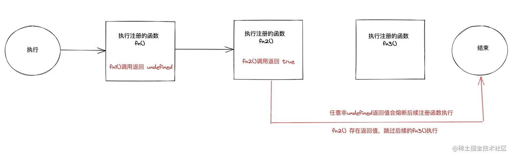
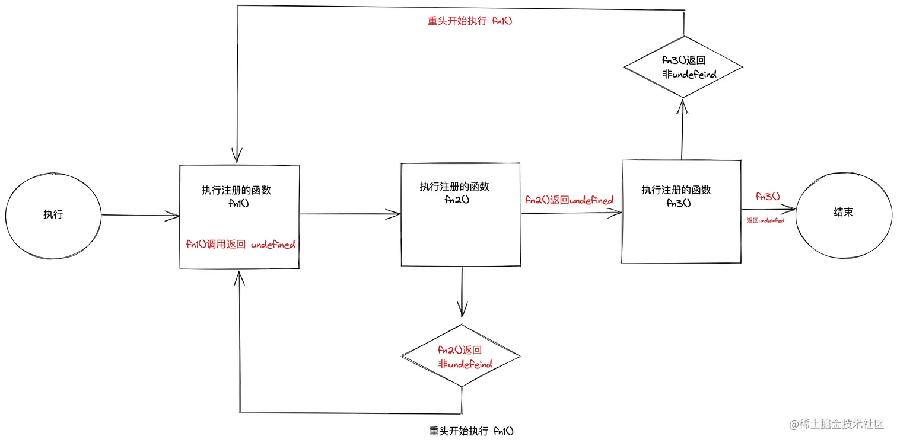
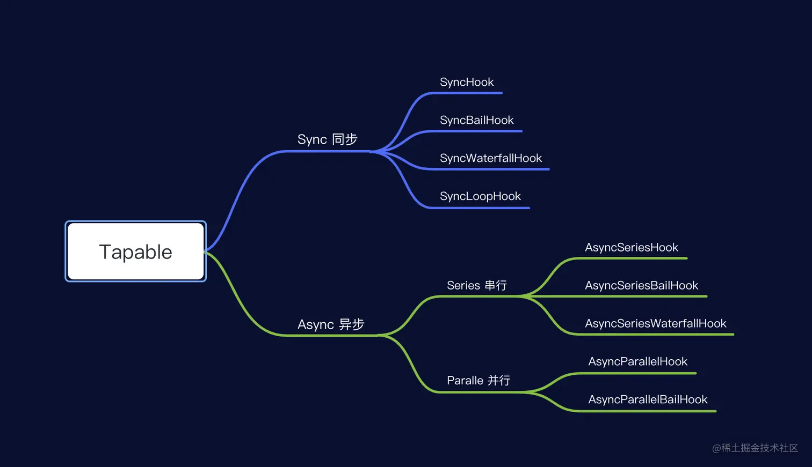

<h1>webpack内部钩子</h1>

钩子的本质是事件,为了方便直接介入和控制编译过程,`webpack`把编译过程中触发的各类关键事件封装成事件接口暴露出来,这些接口被称为`hooks`

## Tapable
`Tapable`是`webpack`的核心工具,许多对象都扩展自`Tapable`类。

它暴露了许多`Hook`类,可用于为插件创建钩子(钩子的实例),钩子是一个抽象概念,只有通过创建实例才能使用钩子的功能

```javascript{4-13} title="index.js"
"use strict";

exports.__esModule = true;
exports.SyncHook = require("./SyncHook");
exports.SyncBailHook = require("./SyncBailHook");
exports.SyncWaterfallHook = require("./SyncWaterfallHook");
exports.SyncLoopHook = require("./SyncLoopHook");
exports.AsyncParallelHook = require("./AsyncParallelHook");
exports.AsyncParallelBailHook = require("./AsyncParallelBailHook");
exports.AsyncSeriesHook = require("./AsyncSeriesHook");
exports.AsyncSeriesBailHook = require("./AsyncSeriesBailHook");
exports.AsyncSeriesLoopHook = require("./AsyncSeriesLoopHook");
exports.AsyncSeriesWaterfallHook = require("./AsyncSeriesWaterfallHook");
exports.HookMap = require("./HookMap");
exports.MultiHook = require("./MultiHook");
```

每一种类型的`Hook`内都使用了`new Hook()`,而`Hook`类中实现了`tap`,`tapAsync`,`tapPromise`等方法,提供给插件来注入自定义构建步骤(注册事件,回调函数)

当到达特定事件点时,会调用某个类型的钩子,执行所有该类型钩子实例上通过`tap`,`tapAsync`,`AsyncPromise`注册的回调函数

## Hooks类型
### 按照执行机制分类
* `Basic Hooks`

    名称中不包含`Waterfall`,`Bail`,`Loop`的`Hooks`,它仅仅执行钩子注册的事件,不关心每个被调用的函数的返回值
    
    
    
* `Waterfall Hooks`

    瀑布式钩子也执行每个注册的函数,但是它会把返回值传递给下一个函数
    
    
    
* `Bail Hooks`

    保险形钩子,当函数返回非`undefined`值时,将停止执行剩余的函数
    
    
    
* `Loop Hooks`

    循环钩子,任意一个函数返回非`undefined`值时,会立即从头开始重新执行所有函数,直到所有函数都返回`undefined`
    
    

### 按照同步/异步分类
* `Sync`

    同步钩子注册的函数会同步执行,只能通过`tap()`注册函数,能通过`call()`,`callAsync()`,`promise`触发同步钩子的执行
    
* `AsyncSeries`

    `AsyncSeries`可以与同步(`tap()`)、基于回调`tapAsync()`、基于`Promise`(`tapPromise()`)的函数配合使用,它们依次调用每个异步方法;通过`callAsync`,`promise`方式触发注册的函数
    
* `AsyncParallel`

    `AsyncParallel`也可以与同步、基于回调、基于`Promise`的函数配合使用,它们并行运行每个异步方法;通过,`callAsync`,`promise`方式触发注册的函数
    
通过源码可以知道,异步的`Hooks`构造器将`call`赋值为`undefined`,所以无法使用`call`来调用
  


## tap类型
* `tap`

    用于钩子实例对象注册同步函数,同步钩子仅能使用`tap`注册同步函数
    
* `tapAsync`

    用于钩子实例对象注册异步回调函数,函数最后一个参数为回调函数,该回调函数类似`nodejs`中的回调函数,第一个参数表示是否存在错误,后续参数表示其他参数

* `tapPromise`

    用于钩子实例对象注册异步`Promise`函数,函数必须返回一个`Promise`
    
## 手动触发钩子

* `call`

    仅能够通过同步钩子实例调用,异步钩子构造器将`call`赋值为`undefined`

* `callAsync`

    能够通过任何类型(同步,异步)钩子实例调用,能触发该异步钩子注册的同步,异步回调,`promise`函数

* `promise`

    能够通过任何类型(同步,异步)钩子实例调用,能触发该异步钩子注册的同步,异步回调,`promise`函数,如果注册的函数中会返回异常,那么一定需要对异常进行处理,如使用`catch`

## tapable示例

### 同步钩子通用情况

* 同步钩子仅能通过`tap`注册函数
* 同步钩子依次执行注册的函数
* 同步钩子能通过`call`,`callAsync`,`promise`手动触发钩子,执行函数
* 同步钩子通过`callAsync`,`promise`触发钩子后,所有注册的函数执行完成后,回调也会触发

### SyncHook
* 注册的函数,返回值不会影响后续注册的函数
* 如果使用`callAsync`或`promise`触发钩子,回调函数和`then`不会收到返回的参数
<details>
<summary>示例代码</summary>

```javascript
<!-- @include: ./tapable-hooks-example/syncHook.js -->
```
</details>


### SyncBailHook
* 注册的函数,一旦返回了一个非`undefined`的值,剩余注册的函数都不会执行
* 上述情况中,如果使用`callAsync`触发钩子,那么回调函数还会接收到两个参数,参数一的值为`null`,参数二的值为返回值
* 上述情况中,如果使用`promise`触发钩子,那么`then`中会接收到一个参数,值为注册函数的返回值
<details>
<summary>示例代码</summary>

```javascript
<!-- @include: ./tapable-hooks-example/syncBailHook.js -->
```
</details>

### SyncWaterfallHook
* 注册的函数,一旦返回了一个非`undefined`值,这个值会覆盖后续所有函数的第一个参数,直到被新的返回值覆盖
* 如果使用`callAsync`触发钩子,回调函数会接收两个参数,参数一为`null`,参数二为最后一个函数的第一个参数值
* 如果使用`promise`触发钩子,`then`会接收一个参数,为最后一个注册函数的第一个参数值
<details>
<summary>示例代码</summary>

```javascript
<!-- @include: ./tapable-hooks-example/syncWaterfallHook.js -->
```
</details>

### SyncLoopHook
* 注册的函数一旦返回了一个非`undefined`值,就会从第一个注册的函数重新开始执行,直到所有函数返回`undefined`
* 如果使用`callAsync`或`promise`触发钩子,回调函数和`then`不会收到参数
<details>
<summary>示例代码</summary>

```javascript
<!-- @include: ./tapable-hooks-example/syncLoopHook.js -->
```
</details>

### 异步钩子通用情况
* 异步钩子可以使用`tap`,`tapAsync`,`tapPromise`来注册函数
* 异步钩子可以使用`callAsync`,`promise`来手动触发钩子,执行函数
* 异步钩子实例使用`tapAsync`注册函数时,参数包含一个`callback`回调函数,它是在手动触发钩子时生成的
* 异步钩子的`tapAsync`中,`callback`的第一个参数表示是否存在错误
### AsyncSeriesHook
* 函数按顺序执行,当前函数完成后再执行下一个(类似`await`)
* 使用`tap`注册的函数,返回值不会影响后续函数的执行
* 使用`tapAsync`或`tapPromise`注册的函数,若不调用`callback`或不改变`promise`状态,后续函数和手动触发后续处理也不会执行(如`callAsync`中`callback`,`promise`的后续处理)
* 使用`tapAsync`注册的函数,若`callback`的第一个参数为`falsy`值,不视为是错误,后续函数正常执行,且该值不会传递给`callAsync`的回调或`promise.then`
* 使用`tapAsync`注册的函数,若`callback`的第一个参数为`truthy`值,后续函数不会执行(同一函数中仅调用一次`callback`),该参数会传递给`callAsync`的回调或`promise.catch`
* 使用`tapPromise`注册的函数,`resolve`后会正常执行后续函数,但是`resolve`的值不会传递给`callAsync`的回调或`promise.then`;
* `tapPromise`注册的函数,`reject`后,后续函数不会执行,`reject`的值会传递给`callAsync`的回调或`promise.catch`
* 若`tapAsync`或`tapPromise`传递了错误,`promise`必须捕获这个错误
* 若`tapAsync`注册的同一个函数中多次调用`callback`:

    * 在`callAsync`中,每次传递`truthy`值都会触发回调。如执行两次`callback`并分别传递`truthy`值,`callAsync`会执行两次回调,每次回调的参数都是分别传递的`truthy`值

    * 如果执行两次`callback`,第一次传递`falsy`,第二次传递`truthy`,`callAsync`会先对错误进行处理,再执行后续函数并再次调用回调
    
    * 对于`promise`,若第一个`callback`传递了`falsy`,后续函数不执行,`promise.catch`接收该参数。若第一个`callback`传递`falsy`,第二个`callback`传递了`truthy`,`promise.catch`会捕获错误,但后续函数仍会执行,但`promise.then`不再执行

    * 若两个`callback`都传递`falsy`,所有函数都执行两次,但`promise.then`只执行一次

<details>
<summary>示例代码</summary>

```javascript
<!-- @include: ./tapable-hooks-example/asyncSeriesHook.js  -->
```
</details>

### AsyncSeriesBailHook
* 使用`tap`注册的函数,返回非`undefined`值,后续函数不会执行,若使用`callAsync`,回调函数接收两个参数,参数一为`null`,参数二为返回值;若使用`promise`,返回值传递给`promise.then`
* 若`tapAsync`注册的函数不使用`callback`或`tapPromise`中不改变状态,后续函数不会执行,`callAsync`的回调或`promise`的后续函数不会执行
* 若`tapAsync`中`callback`第一个参数为`truthy`值,后续函数不会执行,该值传递给`callAsync`的回调或`promise.catch`(相当于报错)
* 若`tapAsync`中`callback`第一个参数为`falsy`值,第二个参数不是`undefined`,后续函数不会执行,若使用`callAsync`,回调函数将接收两个参数,参数一为`null`,参数二为`callback`传递的第二个参数值;若使用`promise`,返回值传递给`promise.then`
* 若`tapPromise`中`resolve`的参数不是`undefined`,后续函数不会执行;若使用`callAsync`,回调函数将接收两个参数,参数一为`null`,参数二为`resolve`的参数;若使用`promise`,`resolve`的参数将传递给`promise.then`
* 若`tapPromise`中`reject`,后续函数不会执行;`reject`的参数将传递给`callAsync`的回调或`promise.catch`(相当于报错)

<details>
<summary>示例代码</summary>

```javascript
<!-- @include ./tapable-hooks-example/asyncSeriesBailHook.js -->
```
</details>

### AsyncSeriesWaterfallHook
