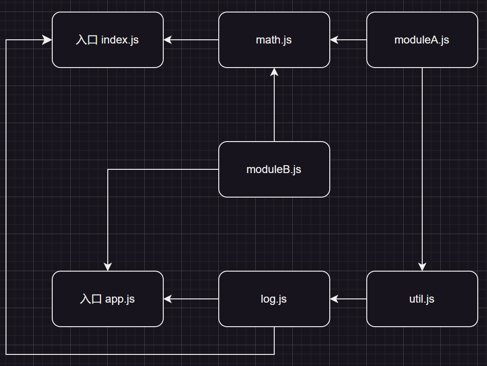

<h1>code solit</h1>

打包代码时会将所有`js`打包到一个文件中,体积太大;

如果只渲染首页,可以只加载首页的js文件,其他文件不应该加载

代码分割做了两件事:

* 1.分割文件
* 2.按需加载

### 多入口
新增入口文件
```
|- src
|   |-main.js
|   |_app.js
```

修改配置
```javascript title="webpack.config.js"
// ... 省略
module.exports = {
    // entry: "./src/main.js",
    entry: {
        index: "./src/index.js",
        app: "./src/app.js"
    },
    output: {
        path: path.resolve(__dirname, "./dist"),
        // filename指定输出文件名,使用chunk的name作为输出名称
        // 打包的资源为chunk,输出的叫bundle
        filename: "[name].bundle.js",
        clean: true
    },
    // ... 省略
}
```

#### entry的值
* 一个字符串
    如`./src/app.js`,仅使用`app.js`作为一个入口文件,`chunk`名称为`main`
* 一个字符串数组
    如`["./src/main.js", "./src/app.js"]`,只有一个文件且`chunk`名称为`main`
* 一个对象,则使用每个`key`作为`chunk`名,对象的值可以为
    * 字符串
    * 字符串数组
    * 对象(descriptor)
        使用`import`指定入口文件
        使用`filename`指定输出,如`pages/app.js`将输出到`dist/pages/app.js`


### 提取重复代码

#### runtimeChunk
`runtimeChunk`控制`webpack`生成的运行时代码的处理方式

运行时代码包括`webpack`用来管理加载模块,模块间交互的代码,如处理模块依赖关系、执行模块加载、动态加载模块、处理异步加载

通常包括

1. 模块加载逻辑: 管理模块加载顺序,确保依赖关系处理正确
2. 模块缓存机制: 通过缓存机制,确保模块在首次加载后不会被重复加载
3. 模块执行上下文: 维护模块的执行环境,确保模块在正确的上下文中执行

`runtimeChunk`有几种不同的值

* `false`: 默认值,运行时代码会内联到入口文件,运行时代码和业务逻辑代码打包在同一个文件中
* `single`: 所有入口点共享一个运行时文件,这会生成一个单独的`runtime`文件,包含所有运行时代码
* `multiple`: 每个入口点都有自己独立的运行时`chunk`

对于多入口引用来说,配置为`single`是极为有用的

1. 它可以将运行时代码单独分离为一个`chunk`,其他`chunk`内容发送变化时,运行时代码不一定会改变,浏览器可以更好的缓存不变的运行时代码
2. 在多入口点的场景中,有可能每个入口文件依赖于同一个模块,如果运行时代码没有被正确管理,可能导致每个入口文件都有独立的运行时代码,这些代码会独立的加载和执行模块,模块可能会在每个入口点被实例化一次,意味着被加载和执行多次,导致多个独立的模块实例引发状态不同步问题

### 入口依赖

#### dependOn
当多个入口文件使用了相同的依赖时,可以使用`dependOn`将依赖提取到单独的`bundle`中共享

在以下示例中

入口`index.js`依赖了`log.js`和`math.js`

入口`app.js`依赖了`log.js`和`moduleB.js`

模块`logs.js`依赖了`util.js`

模块`util.js`依赖了`moduleA.js`

模块`math.js`依赖了`util.js`,`moduleA.js`,`moduleB.js`

:::: code-group
::: code-group-item index.js
```javascript
import { cube } from "./math.js"
import { Pixel } from "./log.js"

cube(3);
Pixel();
```
:::
::: code-group-item app.js
```javascript
import { Pixel } from "./js/log";
import { moduleBfuncA } from "./js/moduleB";

moduleBfuncA();
console.log("这是新增的入口");
Pixel();
```
::: 
::: code-group-item log.js
```javascript
import { commonFunc } from "./util";

console.log("这是一个副作用");
export function Pixel() {
    commonFunc();
    return "Pixel";
}

```
:::
::: code-group-item math.js
```javascript
import { commonFunc } from "./util";
import { moduleAFuncA } from "./moduleA";
import { moduleBfuncA } from "./moduleB";

export function cube(x) {
    return x ** 3;
}
commonFunc();
moduleAFuncA();
moduleBfuncA();
```
:::
::: code-group-item util.js
```javascript
import { moduleAFuncA } from "./moduleA";
moduleAFuncA();
export function commonFunc() {
    console.log("通用公共代码");
    
}
```
:::
::: code-group-item moduleA.js
```javascript
export function moduleAFuncA() {
    return "模块A方法A";
}
```
:::
::: code-group-item moduleB.js
```javascript
export function moduleBfuncA() {
    return "模块B方法A";
}
```
:::
::::
当没有配置`dependOn`时,每个`bundle`都会包含依赖的模块已经模块依赖的模块,存在重复

如: `index.js`和`app.js`都会打包进`log.js`

当配置`dependOn`后
```javascript title="webpack.config.js"
module.exports = {
    // ...
    entry: {
        index: {
            path: "./src/index.js",
            dependOn: "common"
        },
        main: {
            path: "./src/app.js",
            dependOn: "common"
        },
        common: "./src/log.js"
    }
}
```
可以发现`log.js`的内容被单独打包到`common.bundle.js`中,而`index.bundle.js`和`app.bundle.js`中则引用`common.bindle.js`中的`log.js`

同时,`common.bundle.js`还包含了`util.js`和`moduleA.js`,其他模块也同样引用这些模块而不是在多个模块中重复生成

`webpack`会递归解析模块依赖链,如果某个模块被提取到共享`bundle`,该模块的所有依赖也都会被提取到同一个共享的`bundle`中
#### splitChunks
`splitChunksPlugin`插件可以将公共的依赖模块提取到已有的入口`chunk`中或提取到一个新生成的`chunk`

默认情况下,它只会影响到按需加载的`chunks`

`webpack`将根据以下条件自动拆分`chunks`
* 新的`chunk`可以被共享,或模块来自于`node_modules`文件夹
* 新的`chunk`体积大于20kb(在进行min+gz前)
* 当按需加载`chunks`时,并行请求的最大数量小于或等于30
* 当加载初始化页面时,并发请求的最大数量小于或等于30

以下配置表示了`splitChunksPlugin`的默认行为
```javascript title="webpack.config.js"
module.exports = {
    optimization: {
        splitChunks: {
            // 选择哪些chunk进行优化
            // 有效值为async,initial,all
            chunks: 'async',
            // 生成chunk的最小大小,单位字节
            // 生产模式下为20000,否则为10000
            minSize: 20000,
            // 确保拆分后剩余的最小chunk体积超过限制以避免大小为0的模块
            // 开发模式下默认值为0,否则默认值为minSize的值,仅在剩余单个chunk时生效
            minRemainingSize: 0,
            // 至少被引用的次数,满足时才会分割
            minChunks: 1,
            // 按需加载时并行加载的文件最大数量
            // 生产模式下为30,否则为Infinity
            maxAsyncRequests: 30,
            // 入口加载时最大并行请求数量
            // 生产模式下为30,否则为Infinity
            maxInitialRequests: 30,
            // 超过指定大小一定会单独打包(此时忽略minRemainingSize,maxAsyncRequests,maxInitialRequests)
            // 生产模式下为50000,否则为30000
            enforceSizeThreshold: 50000,
            usedExports: optimization.usedExports === true,
            // 由maxSize分割部分创建名称时,阻止公开路径信息
            hidePathInfo: production,
            // 缓存组,能够继承或覆盖来自splitChunks.*的选项,但是test,priority和reuseExistingChunk只能在缓存组级别上配置
            cacheGroups: {
                // 组名
                defaultVendors: {
                    // 控制缓存组选择的模块,省略将选择所有模块
                    test: /[\\/]node_modules[\\/]/,
                    // 权重,一个模块可以属于多个缓存组,优化将考虑具有更高优先级的缓存组
                    priority: -10,
                    // 当前chunk包含从主bundle中拆分的模块,则它被重用,而不是生成新的模块
                    reuseExistingChunk: true
                },
                default: {
                    // 组中的配置会覆盖上面的配置,没写则使用上面的配置
                    minChunks: 2,
                    priority: -20,
                    reuseExistingChunk: true
                }
            }
        }
    }
}
```
::: warning
从`webpack5`开始,不在允许将`${cacheGroup}.test`或`${cacheGroup}.name`设置为`entry`名称
:::

chunks值为`all`,`initial`,`async`的区别
* `async`
    同步加载的模块不被配置的分割策略影响,默认情况下会被打包到主入口文件中

    异步加载的模块会受到分割策略影响
* `initial`

    同步加载的模块会根据配置的分割策略进行分割,生成新的`chunk`

    异步加载的模块依然被打包为`chunk`,但不参与配置中的分割策略,会根据`webpack`默认的异步加载逻辑被处理
* `all`

    同步加载和异步加载的模块都会收到配置中的分割策略影响,异步模块可能被分割为更小的`chunk`

配置多入口时
```javascript title="webpack.config.js"
module.exports = {
    entry: {
        index: "./src/index.js",
        app: "./src/app.js"
    },
    optimization: {
        runtimeChunk: "single",
        splitChunks: {
            chunks: "all",
            cacheGroups: {
                default: {
                    // 由于模块体积太小,所以将minSize设置为0
                    minSize: 0,
                    // 沿用默认值
                    minChunks: 2,
                    priority: -20,
                    reuseExistingChunk: true
                }
            }
        }
    }
}
```
打包结果中多出了`default-src_js_log-src_js_moduleB_js.bundle.js`

内容包含了`log.js`,`moduleA.js`,`moduleB.js`,`util.js`;

其中`log.js`,`moduleA.js`,`moduleB.js`因为在多个模块中使用,所以被抽取出来

而`util.js`因为只被`log.js`依赖,所以也放在一起

如果修改为单入口
```javascript title="webpack.config.js"
module.exports = {
    entry: "./src/index.js",
    // optimization保持不变
}
```
虽然模块`moduleA.js`被`math.js`和`util.js`依赖,但是仍被打包到一个模块中,并没有单独拆分的模块

当使用单入口时,所有被入口文件直接或间接依赖的模块都被视为同一个依赖树的一部分

由于没有其他入口文件或动态导入,且没有大型共享模块(`moduleA`),webpack的默认行为将所有内容打包输出在一个文件中

如果保持多入口,同时配置`dependOn`
```javascript title="webpack.config.js"
module.exports = {
        entry: {
            index: {
                import: "./src/index.js",
                dependOn: "common"
            },
            main: {
                import: "./src/app.js",
                dependOn: "common"
            },
            common: "./src/log.js"
        },
}
```
那么将会新拆分出两个模块`default-src_js_moduleB_js.bundle.js`和`common.bundle.js`

其中`common.bundle.js`包含了`log.js`,`moduleA.js`和`util.js`

而`default-src_js_moduleB_js.bundle.js`包含了`moduleB.js`

因为`dependOn`指定的`log.js`都直接或间接依赖了`log.js`,`moduleA.js`和`util.js`,所以被打包到了`common.bundle.js`,而`moduleB.js`仍在`math.js`和`app.js`中引入,所以被`splitChunks`拆分

### 动态导入
`ECMASCRIPT`的`import()`语法实现动态导入,它依赖于`promise`,所以在旧版本的浏览器中使用,还需要使用`polyfill`库,如[`promise-polyfill`](https://github.com/taylorhakes/promise-polyfill)或[`es6-promise`](https://github.com/stefanpenner/es6-promise)

新增一个模块
```javascript title="moduleC.js"
export function dynamicFunction() {
    return "动态加载";
}
```
修改`index.html`,新增一个按钮`<button title="dynamic" id="dynamic"><button>`

修改入口文件`app.js`
```javascript{6-9} title="app.js"
import { Pixel } from "./js/log";
import { moduleBfuncA } from "./js/moduleB";
moduleBfuncA();
console.log("这是新增的入口");
Pixel();
const btn = document.querySelector("#dynamic");
btn.addEventListener("click", () => {
    import("./js/moduleC").then(res => res.dynamicFunction());
});
```
再次打包后运行,可以发现打包结果中新增了一个`bundle`名为`src-js_moduleC_js.bundle.js`

并且在浏览器中运行,可以看到初始加载时,网络并没有加载`src-js_moduleC_js.bundle.js`

而是点击按钮后,才新增了一个请求,请求了`src-js_moduleC_js.bundle.js`

如果这个模块同时被其他模块同步加载,如`log.js`同步加载了`moduleC.js`
```javascript{2,7} title="log.js"
import { commonFunc } from "./util";
import { dynamicFunction } from "./moduleC";

console.log("这是一个副作用");
export function Pixel() {
    commonFunc();
    dynamicFunction();
    return "Pixel";
}

```
这种情况下,`moduleC.js`不会单独打包,而是和入口打包在一起

因为`log.js`同步依赖`moduleC.js`,要求模块在加载时就能使用;由于这个模块以包含在同步`chunk`中,动态加载部分会直接复用已存在的模块

如果一个模块仅仅被用于动态导入,那么它会被单独打包

如果一个模块同时被同步和动态导入,那么它可能会和同步导入的模块打包在一起

#### 修改动态导入打包后的名称
```javascript{11} title="app.js"
import { Pixel } from "./js/log";
import { moduleBfuncA } from "./js/moduleB";

moduleBfuncA();
console.log("这是新增的入口");
Pixel();

const btn = document.querySelector("#dynamic");

btn.addEventListener("click", () => {
    import(/* webpackChunkName: "moduleC" */"./js/moduleC")
    .then(res => res.dynamicFunction());
});

```
`webpackChunkName: "moduleC"`是`webpack`动态导入模块命名的方式
`moduleC`将来就会作为`[name]`的值显示,`output`中需要配置`filename`

旧版本的`eslint`不支持`import()`语法,需要`eslint-plugin-import`插件解决,新版本已经支持

### 输出命名

#### css文件输出命名
使用`mini-css-extract-plugin`插件时,可以传入配置项修改输出名称
```javascript
new MiniCssExtractPlugin({
    // 每个css文件的名称
    filename: "css/[name].css",
    // 非入口的chunk文件名称
    chunkFilename: "css/[name].chunk.css"
})
```
#### html文件输出命名
```javascript
new HtmlWebpackPlugin({
    filename: "html/[name].html",
})
```
::: warning
如果是多入口,那么会生成多个html
:::
#### js文件输出名称
* 方式一
```javascript{4,6}
output: {
    path: path.resolve(__dirname, "dist"),
    // 输出的每个bundle名称
    filename: "js/[name].bundle.js",
    // 非初始chunk文件的名称
    chunkFilename: "js/[name].chunk.js",
    // 对于资源模块,可以使用这种模式输出,但是会全部放置到一起
    assetModuleFilename: "assets/[name].[hash][ext]"
}
```
* 方式二
```javascript
entry: {
    index: {
        import: "./src/index.js",
        filename: "js/[name].bundle.js"
    }
}
```
##### entry中filename和output.filename区别
output中的filename是全局配置,entry中的filename可以理解为局部配置,可以覆盖全局配置;支持相同的占位符,output.filename默认值为`[name].js`

#### 资源模块输出名称
* 方式一
```javascript{4}
output: {
    filename: "js/[name].bundle.js",
    // 对于资源模块,可以使用这种模式输出,但是会全部放置到一起
    assetModuleFilename: "assets/[name].[hash][ext]"
}
```
* 方式二
```javascript{7}
module: {
    rules: [
        {
            test: "",
            type: "asset", // asset/resource
            generator: {
                filename: "assets/[name].[hash][ext]"
            }
        }
    ]
}
```
::: tip
方式二能够覆盖方式一的配置,方式一的配置会把所有类型的资源放在一起
:::